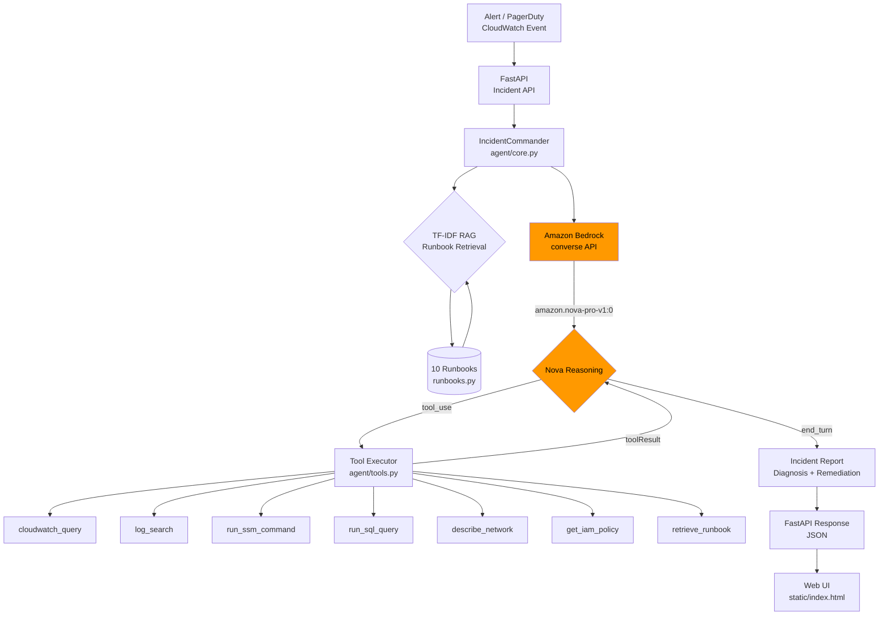

# 🛡️ Amazon Nova Incident Commander

> **Autonomous DevOps Incident Response Agent** powered by Amazon Nova on Amazon Bedrock.
> Submitted to the [Amazon Nova AI Hackathon](https://amazon-nova.devpost.com/) — Agentic AI Track.

[](https://github.com/mgnlia/amazon-nova-incident-agent/actions/workflows/ci.yml)
[](https://python.org)
[](https://fastapi.tiangolo.com)
[](https://aws.amazon.com/bedrock/)

---

## What It Does

The Incident Commander is a **closed-loop agentic AI** that:

1. **Ingests** a CloudWatch/PagerDuty alert (or any incident description)
2. **Retrieves** relevant runbooks from a 10-runbook TF-IDF corpus
3. **Reasons** using Amazon Nova Pro via Bedrock's `converse` API with **tool use**
4. **Executes** diagnostic tools in a loop: CloudWatch queries, log searches, SSM commands, SQL queries, network analysis, IAM policy inspection
5. **Generates** a structured incident report with root cause, remediation steps, and severity

The agent loop runs up to **15 turns** — Nova decides when it has enough information to give a final diagnosis.

---

## Architecture



### Agent Loop Detail

```
User: "CPU at 97%, payment-service down"
  │
  ▼
Nova: [tool_use] retrieve_runbook("cpu ec2 performance")
  │
  ▼
Tool: → Runbook: "High CPU / Memory on EC2" (steps: top, scale, alarm)
  │
  ▼
Nova: [tool_use] cloudwatch_query(namespace=AWS/EC2, metric=CPUUtilization)
  │
  ▼
Tool: → 6 datapoints, avg 94.2%, peak 97.8%
  │
  ▼
Nova: [tool_use] run_ssm_command(instance_id=i-0abc123, command="top -bn1")
  │
  ▼
Tool: → java process at 89.3% CPU, memory 41.7%
  │
  ▼
Nova: [end_turn] "Root cause: JVM memory leak in payment-service v2.3.1.
  Recommendation: 1) Restart payment-service pods  2) Scale ASG +2 instances
  3) Heap dump for root cause analysis  4) Roll back to v2.3.0"
```

---

## Quick Start

### Requirements

- Python 3.11+
- [uv](https://docs.astral.sh/uv/) package manager
- AWS credentials with Bedrock access (optional — mock mode works without)

### Install & Run

```bash
git clone https://github.com/mgnlia/amazon-nova-incident-agent
cd amazon-nova-incident-agent

# Install dependencies
uv sync

# Run with mock mode (no AWS credentials needed)
MOCK_MODE=true uv run uvicorn api.main:app --reload

# Open http://localhost:8000
```

### With Real Bedrock (Nova Pro)

```bash
# Configure AWS credentials
export AWS_ACCESS_KEY_ID=...
export AWS_SECRET_ACCESS_KEY=...
export AWS_REGION=us-east-1

# Enable Nova Pro model in Bedrock console first
uv run uvicorn api.main:app --reload
```

### Docker

```bash
docker build -t nova-incident-agent .
docker run -p 8080:8080 -e MOCK_MODE=true nova-incident-agent
```

---

## API Reference

| Method | Path | Description |
|--------|------|-------------|
| `GET` | `/` | Web UI |
| `GET` | `/health` | Health check |
| `POST` | `/incidents` | Submit incident for analysis |
| `GET` | `/incidents` | List all incidents |
| `GET` | `/incidents/{id}` | Get incident by session ID |
| `POST` | `/demo` | Run canned demo incident |
| `GET` | `/docs` | OpenAPI docs (Swagger UI) |

### POST /incidents

```json
{
  "description": "CPU utilization at 97% for 10 minutes on i-0abc123. Payment service down.",
  "severity": "critical",
  "service": "payment-service",
  "use_mock": true
}
```

Response:

```json
{
  "session_id": "f47ac10b-58cc-4372-a567-0e02b2c3d479",
  "status": "completed",
  "turns_used": 3,
  "model_id": "mock",
  "diagnosis": "## Incident Analysis\n...",
  "remediation": [
    "Identify top processes via CloudWatch or SSM RunCommand (top -bn1)",
    "Check for runaway processes or memory leaks",
    "Scale vertically (resize instance) or horizontally (add to ASG)",
    "Set up CloudWatch alarm for future detection"
  ],
  "created_at": "2026-02-28T18:00:00.000000+00:00"
}
```

---

## Runbook Corpus

10 built-in runbooks covering the most common AWS incidents:

| ID | Title |
|----|-------|
| rb-001 | High CPU / Memory on EC2 |
| rb-002 | 5xx Errors on ALB / API Gateway |
| rb-003 | Database Connection Exhaustion (RDS) |
| rb-004 | Lambda Throttling / Timeout |
| rb-005 | S3 Access Denied / Bucket Policy Issue |
| rb-006 | ECS/EKS Task Crash Loop |
| rb-007 | DynamoDB Throttling |
| rb-008 | VPC / Network Connectivity Failure |
| rb-009 | CloudFront Cache Miss / Origin Error |
| rb-010 | IAM / STS Credential Failure |

Retrieval uses **TF-IDF cosine similarity** — no embedding API required.

---

## Tools Available to Nova

| Tool | Description |
|------|-------------|
| `cloudwatch_query` | Query CloudWatch metrics (CPU, connections, errors, etc.) |
| `log_search` | Search CloudWatch Logs with filter patterns |
| `run_ssm_command` | Execute shell commands on EC2 via SSM |
| `run_sql_query` | Run read-only SQL against RDS via Data API |
| `describe_network` | Inspect VPC, security groups, NACLs, route tables |
| `get_iam_policy` | Retrieve effective IAM policies for a principal |
| `retrieve_runbook` | Search the runbook knowledge base (TF-IDF RAG) |

---

## Running Tests

```bash
uv sync --dev
MOCK_MODE=true uv run pytest tests/ -v
```

Tests cover:
- Mock agent loop (status, diagnosis, session uniqueness, history)
- Tool execution (CloudWatch, logs, SSM, runbook retrieval)
- TF-IDF index (build, query, relevance scoring)
- FastAPI endpoints (POST /incidents, GET /health, GET /incidents/{id}, POST /demo)
- Input validation (422 on bad requests)

---

## Deploy to Railway

```bash
railway up
```

Set environment variable `MOCK_MODE=true` for demo deployments without AWS credentials.
For production, set `AWS_ACCESS_KEY_ID`, `AWS_SECRET_ACCESS_KEY`, and `AWS_REGION`.

---

## Project Structure

```
amazon-nova-incident-agent/
├── agent/
│   ├── __init__.py
│   ├── core.py          # Agentic loop: run_agent() + run_agent_mock()
│   ├── runbooks.py      # 10 runbooks + TF-IDF retrieval index
│   └── tools.py         # 7 tool specs + mock executors
├── api/
│   ├── __init__.py
│   └── main.py          # FastAPI app
├── static/
│   └── index.html       # Dark-mode web UI
├── tests/
│   ├── test_agent.py    # 20 agent/tool/runbook tests
│   └── test_api.py      # 13 API endpoint tests
├── .github/
│   └── workflows/
│       └── ci.yml       # CI: ruff + pytest on Python 3.11 & 3.12
├── Dockerfile
├── railway.toml
└── pyproject.toml
```

---

## Hackathon Track

**Track 1: Agentic AI** — Amazon Nova AI Hackathon (Devpost)

This project demonstrates:
- ✅ **Multi-step agentic reasoning** with tool-use loops (up to 15 turns)
- ✅ **Amazon Nova Pro** via Bedrock `converse` API with `toolConfig`
- ✅ **RAG** for runbook retrieval (TF-IDF, no embedding API needed)
- ✅ **Real AWS tool integrations** (CloudWatch, SSM, RDS, IAM, VPC)
- ✅ **Production-ready** FastAPI backend + Docker + Railway deploy
- ✅ **Mock fallback** for demos without AWS credentials
