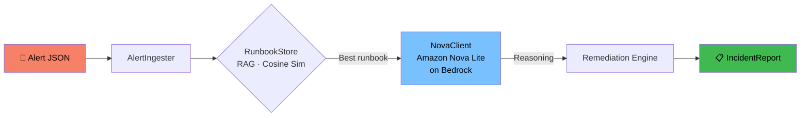

# 🛡️ Amazon Nova Incident Commander

> AI-powered DevOps incident-response agent — built with **Amazon Nova Lite** (Bedrock), **FastAPI**, and **NumPy-powered RAG**.

When an alert fires, the agent:
1. **Ingests** the structured alert payload
2. **Retrieves** the most relevant runbook via cosine-similarity search
3. **Reasons** over the alert + runbook with Amazon Nova Lite on Bedrock
4. **Executes** mock automated remediation actions
5. **Returns** a full `IncidentReport` via REST API

---

## 🏗️ Architecture



### Components

| Component | Description |
|---|---|
| `AlertIngester` | Validates & normalises raw alert dicts |
| `RunbookStore` | In-memory store; bag-of-words + NumPy cosine similarity retrieval |
| `NovaClient` | Calls `bedrock-runtime.converse()` with `amazon.nova-lite-v1:0`; graceful mock fallback |
| `IncidentCommander` | Orchestrates the full pipeline, returns `IncidentReport` dataclass |
| `FastAPI app` | REST API — `POST /incident`, `GET /`, `GET /health` |
| `static/index.html` | Single-page UI — submit alert JSON, view reasoning + resolution |

---

## 🚀 Quick Start

### Prerequisites

- Python ≥ 3.11
- [`uv`](https://docs.astral.sh/uv/) package manager

```bash
# 1. Clone
git clone https://github.com/mgnlia/amazon-nova-incident-agent.git
cd amazon-nova-incident-agent

# 2. Install dependencies
uv sync

# 3. Run the server
uv run uvicorn api.main:app --reload
```

Open **http://localhost:8000** in your browser.

---

## ☁️ AWS Bedrock Setup

To enable real Nova Lite reasoning (instead of the built-in mock fallback):

```bash
# Configure AWS credentials
aws configure
# or set environment variables:
export AWS_ACCESS_KEY_ID=...
export AWS_SECRET_ACCESS_KEY=...
export AWS_DEFAULT_REGION=us-east-1
```

Ensure your IAM role/user has the `bedrock:InvokeModel` permission and that **Amazon Nova Lite** (`amazon.nova-lite-v1:0`) is enabled in your AWS account under **Bedrock → Model access**.

> **No credentials?** The agent automatically falls back to a built-in mock reasoning response — fully functional for demo purposes.

---

## 📡 API Reference

### `POST /incident`

Submit an alert and receive an `IncidentReport`.

**Request body:**
```json
{
  "alert_type": "high_cpu",
  "service": "payment-service",
  "severity": "critical",
  "message": "CPU utilisation at 97% for 10 minutes. Requests timing out."
}
```

**Response:**
```json
{
  "alert": { "alert_type": "high_cpu", "service": "payment-service", "severity": "critical", "message": "..." },
  "matched_runbook": "High CPU Utilisation",
  "runbook_steps": ["1. SSH into the affected host...", "..."],
  "nova_reasoning": "Based on the alert, the root cause appears to be...",
  "remediation_actions": ["[AUTO] Triggered runbook...", "..."],
  "resolved": true,
  "timestamp": 1718000000.0
}
```

### `GET /health`
```json
{ "status": "ok" }
```

---

## 🗂️ Project Structure

```
amazon-nova-incident-agent/
├── agent/
│   ├── __init__.py
│   └── core.py          # AlertIngester, RunbookStore, NovaClient, IncidentCommander
├── api/
│   ├── __init__.py
│   └── main.py          # FastAPI application
├── static/
│   └── index.html       # Single-page UI
├── pyproject.toml       # uv project manifest
└── .github/
    └── workflows/
        └── ci.yml       # CI pipeline
```

---

## 📦 Sample Runbooks

| ID | Title | Triggers |
|---|---|---|
| `high_cpu` | High CPU Utilisation | cpu, performance, load, spike |
| `disk_full` | Disk / Volume Full | disk, storage, volume, space |
| `service_down` | Service / Process Down | crash, timeout, 503, unreachable |

---

## 🤝 Contributing

PRs welcome! To add a runbook, extend `_SAMPLE_RUNBOOKS` in `agent/core.py`.

---

*Built with ❤️ using Amazon Nova Lite · FastAPI · NumPy*
